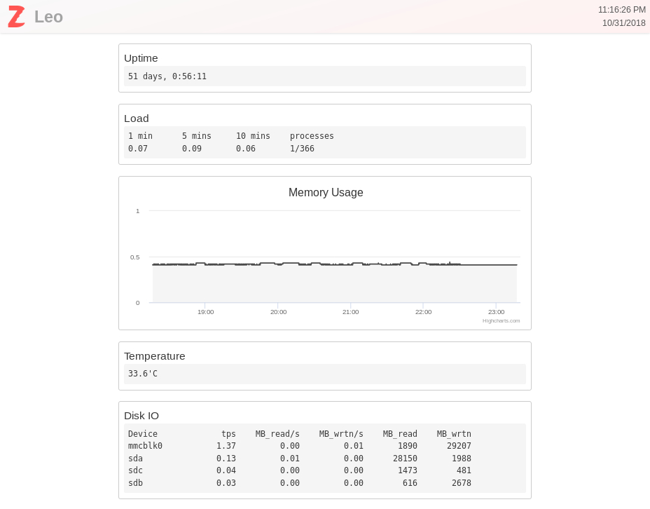

## Zoidboard

Zoidboard is a simple, easy to configure, and easy to extend system monitoring tool. It
has a number of builtin plugins that give you instant insight into system uptime, memory
usage and load, but you can easily write custom plugins for anything else you want to
monitor.

</img>

## Quickstart
TODO
